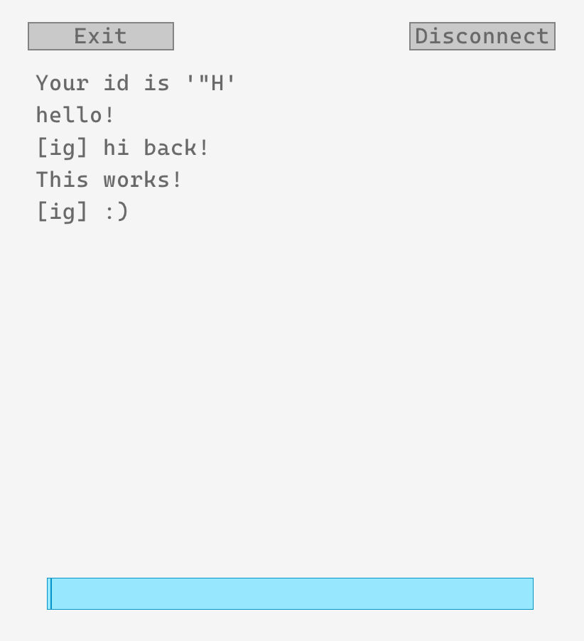

ChAT
=====
ChAT (Chronically Active Transmission) is a very simple
chatting programm. It consists of two parts: a server
and a client. Clients can connect to the server to
exchange messages between each other.

## Encryption
Encryption in this project is rather weak, so don't
use it for anything serious. We are relying on a
modification of vigere cypher. Look into the
source -- it is around 30 lines long. You have
to share a certain key (preferably offline)
to be able to decypher each other's messages.

My suggestion -- write out on a piece of paper
30-100 different relatively long keys and number
them. Keep it with you, don't show it to anybody.
Then always connect using key #1, someone picks
a random number and you re-join using the key
with this number. Thus you can have 'rotating'
keys'

Keep in mind that the algorithm is for the most
part 'security through obscurity'.

## Building
Use `make`. This will build server and the client.
If you want to connect from windows, use
`make win-client`. This will cross-compile it
for windows. If you are compiling from windows,
just modify the command in the Makefile. Note that
the server is not cross-platform, it is only
for linux.

## Running
Start the server on the server host like so:
`./server <port> <logfile>`. Then connect
to the server using `./client XXX.XXX.XXX.XXX:PORT`.
Alternatively, start the `./gui-client`, enter
your preshared key, and then click `connect`.
After the connection has been established,
you can chat.